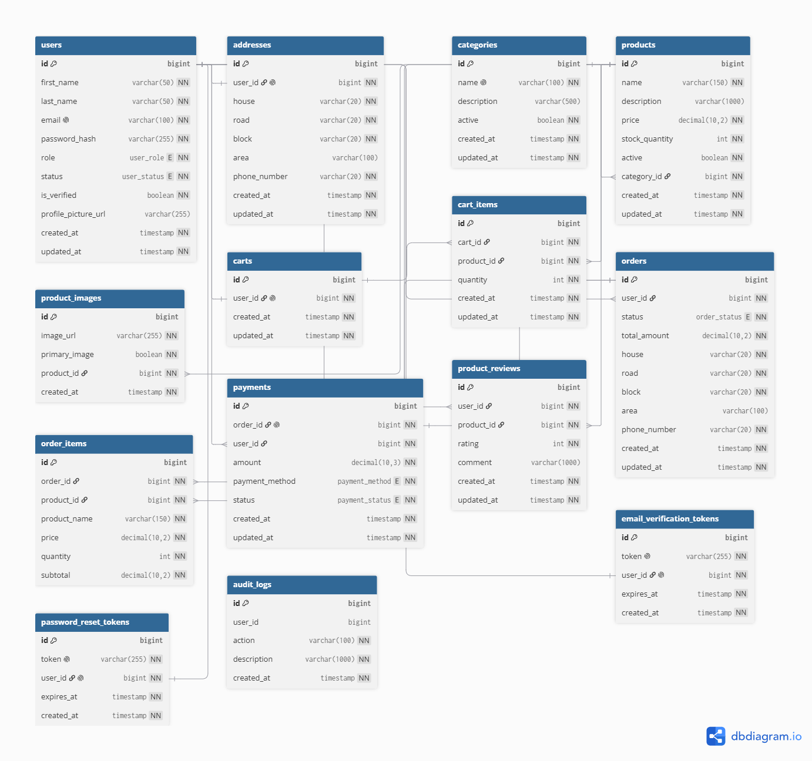

# Online Store

This project is an online store backend built with Spring Boot. The application allows customers to browse products, manage a shopping cart, place orders, make Cash on Delivery payments, manage their profile and address, and review purchased products.

Administrators can manage products, categories, product images, users, and order statuses.

## Features

### Customer Features

- Register a customer account
- Email verification
- Login using JWT authentication
- Forgot and reset password
- Change password
- View and update profile
- Upload profile picture
- Save and update delivery address
- Browse products and categories
- Search and filter products
- Sort products
- Product pagination
- View product images
- Add products to cart
- Update cart quantities
- Remove products from cart
- Checkout and create orders
- Cash on Delivery payment
- View order history
- Cancel eligible orders
- Receive real-time order status notifications
- Review products from delivered orders
- Update and delete own reviews

### Admin Features

- View registered users
- Activate or deactivate user accounts
- Create, update and delete categories
- Create, update and delete products
- Activate or deactivate products
- Upload and manage product images
- Select a primary product image
- View all customer orders
- Update order statuses
- View audit logs

## Technologies Used

- Java 17
- Spring Boot 4.1.1
- Spring Web MVC
- Spring Data JPA
- Spring Security
- JWT
- PostgreSQL
- Jakarta Validation
- Spring Mail
- Swagger / OpenAPI
- Maven
- JUnit
- Mockito

## Project Architecture

The project follows a layered architecture:

```text
src/main/java/com/ga/store/

├── config
├── controller
├── dto
├── enums
├── exception
├── model
├── repository
├── security
└── service
```

### Controller

Handles HTTP requests and API responses.

### Service

Contains application business logic.

### Repository

Handles communication with the PostgreSQL database using Spring Data JPA.

### Model

Contains the JPA entities used to represent database tables.

### DTO

Contains request and response objects used by the API.

### Security

Contains JWT authentication and Spring Security configuration.

### Exception

Contains custom exceptions and global API exception handling.

## Database

The application uses PostgreSQL.

The main database tables include:

- users
- addresses
- categories
- products
- product_images
- carts
- cart_items
- orders
- order_items
- payments
- product_reviews
- email_verification_tokens
- password_reset_tokens
- audit_logs

### Entity Relationship Diagram

The following ERD shows the main database tables and their relationships:



## User Roles

The application contains two roles:

### CUSTOMER

Customers can browse products, manage their cart, place orders, manage their profile, and review products.

### ADMIN

Administrators can manage users, products, categories, product images, orders, and audit logs.

Admin-only operations are protected using Spring Security role-based authorization.

## Order Status Workflow

Orders follow this status flow:

```text
PENDING
   |
   v
CONFIRMED
   |
   v
PROCESSING
   |
   v
SHIPPED
   |
   v
DELIVERED
```

Orders can also be cancelled while they are:

```text
PENDING
CONFIRMED
```

When an eligible order is cancelled, the product stock is restored.

## Payment

The current payment method is:

```text
CASH_ON_DELIVERY
```

Payment statuses include:

```text
PENDING
PAID
FAILED
REFUNDED
CANCELLED
```

A Cash on Delivery payment is marked as paid when the order reaches the `DELIVERED` status.

## Product Stock

Stock is checked during checkout.

The application uses pessimistic database locking when allocating product stock to help prevent multiple customers from purchasing more stock than is available.

Cancelled orders restore their quantities back to product stock.

## Product Reviews

Customers can only review a product when:

- They are logged in
- They purchased the product
- The associated order has been delivered
- They have not already reviewed that product

Each customer can create only one review per product.

Ratings range from 1 to 5.

## Search, Filtering, Pagination and Sorting

The product API supports:

- Product name search
- Category filtering
- Pagination
- Sorting

Supported sorting fields:

```text
name
price
createdAt
```

Supported directions:

```text
asc
desc
```

Example:

```text
GET /api/products?search=soap&categoryId=1&page=0&size=10&sort=price,asc
```

## Authentication

Authentication uses JSON Web Tokens (JWT).

After a successful login, the API returns a JWT.

Protected endpoints require:

```text
Authorization: Bearer <token>
```

JWT authentication is stateless.

Passwords are stored using BCrypt password hashing.

## Email Features

Spring Mail is used for:

- Email verification
- Password reset
- Order confirmation
- Order cancellation
- Order delivery notification

## Real-Time Notifications

The application uses Server-Sent Events (SSE) to provide real-time order status notifications.

Endpoint:

```text
GET /api/notifications/orders
```

Authenticated customers can subscribe to this endpoint and receive updates when the status of one of their orders changes.

## Rate Limiting

Rate limiting is applied to public authentication endpoints.

Current limits include:

```text
Register:
3 requests per 10 minutes

Login:
5 requests per minute

Forgot Password:
3 requests per 10 minutes
```

## Audit Logging

Important administrative and order actions are recorded in the audit log.

Examples include:

- User status changes
- Order cancellation
- Order status changes

Administrators can access the audit log through the API.

## API Documentation

Swagger/OpenAPI documentation is available while the application is running.

Swagger UI:

```text
http://localhost:9091/swagger-ui.html
```

OpenAPI JSON:

```text
http://localhost:9091/v3/api-docs
```

## Main API Endpoints

### Authentication

```text
POST /api/auth/register
POST /api/auth/login
GET  /api/auth/verify-email
POST /api/auth/resend-verification
POST /api/auth/forgot-password
POST /api/auth/reset-password
```

### Users

```text
GET   /api/users/me
PUT   /api/users/me
POST  /api/users/me/profile-picture
PATCH /api/users/me/password

GET   /api/users/admin
GET   /api/users/admin/{userId}
PATCH /api/users/admin/{userId}/status
```

### Categories

```text
GET    /api/categories
GET    /api/categories/{id}
POST   /api/categories
PUT    /api/categories/{id}
DELETE /api/categories/{id}
```

Creating, updating and deleting categories requires ADMIN access.

### Products

```text
GET    /api/products
GET    /api/products/{id}
GET    /api/products/category/{categoryId}

GET    /api/products/admin
GET    /api/products/admin/{id}

POST   /api/products
PUT    /api/products/{id}
PATCH  /api/products/{id}/status
DELETE /api/products/{id}
```

Product management operations require ADMIN access.

### Product Images

```text
POST   /api/product-images/upload
GET    /api/product-images/product/{productId}
GET    /api/product-images/admin/product/{productId}
PATCH  /api/product-images/{id}/primary
DELETE /api/product-images/{id}
```

Product image management requires ADMIN access.

### Address

```text
POST   /api/addresses/me
GET    /api/addresses/me
PUT    /api/addresses/me
DELETE /api/addresses/me
```

### Cart

```text
GET    /api/cart
POST   /api/cart/items
PATCH  /api/cart/items/{cartItemId}
DELETE /api/cart/items/{cartItemId}
DELETE /api/cart
```

### Orders

```text
POST  /api/orders/checkout
GET   /api/orders/me
GET   /api/orders/me/{orderId}
PATCH /api/orders/me/{orderId}/cancel

GET   /api/orders/admin
PATCH /api/orders/admin/{orderId}/status
```

### Payments

```text
POST /api/payments/orders/{orderId}
GET  /api/payments/orders/{orderId}
GET  /api/payments/me
GET  /api/payments/admin
```

### Reviews

```text
POST   /api/reviews/product/{productId}
GET    /api/reviews/product/{productId}
GET    /api/reviews/me
PUT    /api/reviews/{reviewId}
DELETE /api/reviews/{reviewId}
```

### Audit Logs

```text
GET /api/audit-logs
```

ADMIN access is required.

### Real-Time Notifications

```text
GET /api/notifications/orders
```

## Running the Project

### Requirements

Before running the project, install:

- Java 17
- PostgreSQL
- Maven or use the included Maven Wrapper
- IntelliJ IDEA or another Java IDE

### 1. Clone the Repository

```bash
git clone https://github.com/M7139/store.git
```

Open the project in IntelliJ IDEA.

### 2. Create a PostgreSQL Database

Create a PostgreSQL database for the application.

Example:

```text
store
```

### 3. Configure Environment Variables

The application reads sensitive configuration from environment variables.

Development variables:

```text
DB_URL
DB_USERNAME
DB_PASSWORD
JWT_SECRET
EMAIL_USERNAME
EMAIL_PASSWORD
```

Example database URL:

```text
jdbc:postgresql://localhost:5432/store
```

The JWT secret must contain a valid Base64 encoded secret key.


### 4. Run the Application

Run:

```text
StoreApplication.java
```

The server runs on:

```text
http://localhost:9091
```

## Spring Profiles

The project includes separate Spring profiles.

### Development

```text
application-dev.properties
```

Uses:

```text
DB_URL
DB_USERNAME
DB_PASSWORD
JWT_SECRET
```

### Test

```text
application-test.properties
```

Uses:

```text
TEST_DB_URL
TEST_DB_USERNAME
TEST_DB_PASSWORD
TEST_JWT_SECRET
```

## Development Seed Data

The development profile includes sample data for testing the application.

Demo accounts include:

```text
ADMIN
Email: admin@sedar.com
Password: Admin123!

CUSTOMER
Email: customer@sedar.com
Password: Customer123!
```

The development database is also populated with sample categories and products.

These accounts are intended for development and demonstration purposes only.

## Automated Testing

Automated tests cover the important application requirements.

Current test areas include:

- Authentication
- DTO validation
- Product stock availability
- Order cancellation
- Role-based authorization
- Product service business logic

## Validation and Error Handling

Request DTOs use Jakarta Bean Validation.

Examples include:

- Required fields
- Email validation
- Password rules
- Positive prices
- Non-negative stock
- Review rating limits

API errors return a consistent response containing:

```text
timestamp
status
error
message
path
```

The application handles common errors such as:

- Invalid credentials
- Missing resources
- Duplicate information
- Invalid input
- Inactive accounts
- Unverified accounts
- Expired tokens
- Rate limit violations

## Security

Security features include:

- BCrypt password hashing
- JWT authentication
- Stateless sessions
- Role-based authorization
- ADMIN protected endpoints
- Inactive account blocking
- Email verification
- Password reset tokens
- Authentication rate limiting
- Environment variables for secrets
- Git ignored local environment files

## Trello Board

Project planning and progress tracking:

https://trello.com/b/dx0au4XC/store-app

## Repository

GitHub:

https://github.com/M7139/store

## Credits and Resources

This project was developed as part of the Java Development Bootcamp.

Documentation and guides used as references during development include:

### Official Documentation

- [Spring Boot Documentation](https://docs.spring.io/spring-boot/)
- [Spring Security Documentation](https://docs.spring.io/spring-security/reference/)
- [Spring Data JPA Documentation](https://docs.spring.io/spring-data/jpa/reference/)
- [PostgreSQL Documentation](https://www.postgresql.org/docs/)
- [JJWT Documentation](https://github.com/jwtk/jjwt)
- [Springdoc OpenAPI / Swagger](https://springdoc.org/)
- [Jakarta Bean Validation](https://jakarta.ee/specifications/bean-validation/)
- [JUnit Documentation](https://junit.org/junit5/docs/current/user-guide/)
- [Mockito Documentation](https://site.mockito.org/)
- [Maven Documentation](https://maven.apache.org/guides/)
- [dbdiagram.io](https://dbdiagram.io/)

### Guides and Tutorials

- [Building REST Services with Spring](https://spring.io/guides/tutorials/rest/)  
  Guide covering REST controllers, HTTP methods, and REST API structure.

- [Accessing Data with JPA](https://spring.io/guides/gs/accessing-data-jpa/)  
  Guide covering JPA entities, repositories, and database persistence.

- [Securing a Web Application](https://spring.io/guides/gs/securing-web/)  
  Introduction to Spring Security and protecting application resources.

- [Validating Form Input](https://spring.io/guides/gs/validating-form-input/)  
  Guide covering validation annotations and input validation.

- [Uploading Files with Spring Boot](https://spring.io/guides/gs/uploading-files/)  
  Guide covering multipart file uploads used for product and profile images.

- [Testing the Web Layer](https://spring.io/guides/gs/testing-web/)  
  Guide introducing automated testing in Spring applications.

- [JWT Authentication with Spring Security](https://www.baeldung.com/spring-security-sign-jwt-token)  
  Guide covering JWT signing, authentication, and Spring Security integration.

- [Guide to Spring Email](https://www.baeldung.com/spring-email)  
  Tutorial covering sending emails with Spring and Spring Boot.

- [Mockito Tutorial Series](https://www.baeldung.com/Mockito-series)  
  Guides covering mocking, verification, and unit testing with Mockito.
## Project Status

Backend development is complete.

The backend currently includes authentication, authorization, product management, shopping cart functionality, checkout, orders, payments, reviews, notifications, security features, API documentation, and automated testing.

Adding Stripe for payment is the next stage of the project.
